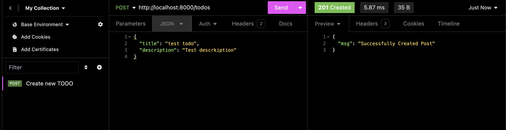

Trong bài trước, chúng ta đã khởi tạo Postgre database và kết nối tới server, trong bài này chúng ta sẽ tạo một table, khởi tạo seed data, thêm vài layers mới cho dự án.

Source code cho toàn bộ series: 
[Github](https://github.com/quang-ng/gin-http-server-demo)

## Thiết kế model và tạo table

Tạo file `model/todo.go` và follow code:

```go
package models

import "time"

type Todo struct {
	ID          int64     `gorm:"primary_key;auto_increment" json:"id"`
	Title       string    `gorm:"size:200" json:"title"`
	Description string    `gorm:"size:3000" json:"description" `
	CreatedAt   time.Time `json:"created_at,omitempty"`
	UpdatedAt   time.Time `json:"updated_at,omitempty"`
}

// TableName method sets table name for TODO model
func (todo *Todo) TableName() string {
	return "todo"
}

// ResponseMap -> response map method of TODO
func (todo *Todo) ResponseMap() map[string]interface{} {
	resp := make(map[string]interface{})
	resp["id"] = todo.ID
	resp["title"] = todo.Title
	resp["body"] = todo.Description
	resp["created_at"] = todo.CreatedAt
	resp["updated_at"] = todo.UpdatedAt
	return resp
}
```

Trong file này, chúng ta tạo một model, sau đó GORM sẽ giúp chúng ta tạo table trong postgres database.

## Repository layer

Tạo file `api/repository/todo.go` với nôi dung như sau

```go
package repository

import (
	"todolist/infrastructure"
	"todolist/models"
)

// TodoRepository -> TodoRepository
type TodoRepository struct {
	db infrastructure.Database
}

// NewTodoRepository : fetching database
func NewTodoRepository(db infrastructure.Database) TodoRepository {
	return TodoRepository{
		db: db,
	}
}

// Save -> Method for saving todo to database
func (p TodoRepository) Save(todo models.Todo) error {
	return p.db.DB.Create(&todo).Error
}

// FindAll -> Method for fetching all todos from database
func (p TodoRepository) FindAll(todo models.Todo, keyword string) (*[]models.Todo, int64, error) {
	var todos []models.Todo
	var totalRows int64 = 0

	queryBuider := p.db.DB.Order("created_at desc").Model(&models.Todo{})

	// Search parameter
	if keyword != "" {
		queryKeyword := "%" + keyword + "%"
		queryBuider = queryBuider.Where(
			p.db.DB.Where("todo.title LIKE ? ", queryKeyword))
	}

	err := queryBuider.
		Where(todo).
		Find(&todos).
		Count(&totalRows).Error
	return &todos, totalRows, err
}

// Update -> Method for updating Post
func (p TodoRepository) Update(todo models.Todo) error {
	return p.db.DB.Save(&todo).Error
}

// Find -> Method for fetching post by id
func (p TodoRepository) Find(todo models.Todo) (models.Todo, error) {
	var todos models.Todo
	err := p.db.DB.
		Debug().
		Model(&models.Todo{}).
		Where(&todo).
		Take(&todos).Error
	return todos, err
}

// Delete Deletes Post
func (p TodoRepository) Delete(todo models.Todo) error {
	return p.db.DB.Delete(&todo).Error
}

```

Layer này dùng để connect tới DB, và thực hiện một số hàm CURD cơ bản bằng cách sử dụng thư viện GORM.

## Services layer

Tạo file `api/service/todo.go` với nội dung:

```go
package service

import (
	"todolist/api/repository"
	"todolist/models"
)

// TodoService TodoService struct
type TodoService struct {
	repository repository.TodoRepository
}

// NewTodoService : returns the TodoService struct instance
func NewTodoService(r repository.TodoRepository) TodoService {
	return TodoService{
		repository: r,
	}
}

// Save -> calls todo repository save method
func (p TodoService) Save(todo models.Todo) error {
	return p.repository.Save(todo)
}

// FindAll -> calls todo repo find all method
func (p TodoService) FindAll(todo models.Todo, keyword string) (*[]models.Todo, int64, error) {
	return p.repository.FindAll(todo, keyword)
}

// Update -> calls todorepo update method
func (p TodoService) Update(todo models.Todo) error {
	return p.repository.Update(todo)
}

// Delete -> calls todo repo delete method
func (p TodoService) Delete(id int64) error {
	var todo models.Todo
	todo.ID = id
	return p.repository.Delete(todo)
}

// Find -> calls todo repo find method
func (p TodoService) Find(todo models.Todo) (models.Todo, error) {
	return p.repository.Find(todo)
}

```

Layer dùng dể giao tiếp giữa controler và repository layer, thực hiện những business rule. Trong project này, business đơn giản chỉ là call repository function tương ứng.


## Controller layer

File: `api/controller/todo.go`
```go
package controller

import (
	"net/http"
	"strconv"
	"todolist/api/service"
	"todolist/models"
	"todolist/util"

	"github.com/gin-gonic/gin"
)

// TodoController -> TodoController
type TodoController struct {
	service service.TodoService
}

// NewTodoController : NewTodoController
func NewTodoController(s service.TodoService) TodoController {
	return TodoController{
		service: s,
	}
}

// GetTodos : GetTodos controller
func (p TodoController) GetTodos(ctx *gin.Context) {
	var todos models.Todo

	keyword := ctx.Query("keyword")

	data, total, err := p.service.FindAll(todos, keyword)

	if err != nil {
		util.ErrorJSON(ctx, http.StatusBadRequest, "Failed to find questions")
		return
	}
	respArr := make([]map[string]interface{}, 0, 0)

	for _, n := range *data {
		resp := n.ResponseMap()
		respArr = append(respArr, resp)
	}

	ctx.JSON(http.StatusOK, &util.Response{
		Success: true,
		Message: "Todo result set",
		Data: map[string]interface{}{
			"rows":       respArr,
			"total_rows": total,
		}})
}

// AddTodo : AddTodo controller
func (p *TodoController) AddTodo(ctx *gin.Context) {
	var todo models.Todo
	ctx.ShouldBindJSON(&todo)

	if todo.Title == "" {
		util.ErrorJSON(ctx, http.StatusBadRequest, "Title is required")
		return
	}
	if todo.Description == "" {
		util.ErrorJSON(ctx, http.StatusBadRequest, "Body is required")
		return
	}
	err := p.service.Save(todo)
	if err != nil {
		util.ErrorJSON(ctx, http.StatusBadRequest, "Failed to create post")
		return
	}
	util.SuccessJSON(ctx, http.StatusCreated, "Successfully Created Post")
}

// GetTodo : get Todo by id
func (p *TodoController) GetTodo(c *gin.Context) {
	idParam := c.Param("id")
	id, err := strconv.ParseInt(idParam, 10, 64) //type conversion string to int64
	if err != nil {
		util.ErrorJSON(c, http.StatusBadRequest, "id invalid")
		return
	}
	var todo models.Todo
	todo.ID = id
	foundTodo, err := p.service.Find(todo)
	if err != nil {
		util.ErrorJSON(c, http.StatusBadRequest, "Error Finding Post")
		return
	}
	response := foundTodo.ResponseMap()

	c.JSON(http.StatusOK, &util.Response{
		Success: true,
		Message: "Result set of Post",
		Data:    &response})

}

func (p *TodoController) DeleteTodo(c *gin.Context) {
	idParam := c.Param("id")
	id, err := strconv.ParseInt(idParam, 10, 64) //type conversion string to uint64
	if err != nil {
		util.ErrorJSON(c, http.StatusBadRequest, "id invalid")
		return
	}
	err = p.service.Delete(id)

	if err != nil {
		util.ErrorJSON(c, http.StatusBadRequest, "Failed to delete Post")
		return
	}
	response := &util.Response{
		Success: true,
		Message: "Deleted Sucessfully"}
	c.JSON(http.StatusOK, response)
}

// UpdateTodo : get update by id
func (p TodoController) UpdateTodo(ctx *gin.Context) {
	idParam := ctx.Param("id")

	id, err := strconv.ParseInt(idParam, 10, 64)

	if err != nil {
		util.ErrorJSON(ctx, http.StatusBadRequest, "id invalid")
		return
	}
	var todo models.Todo
	todo.ID = id

	todoRecord, err := p.service.Find(todo)

	if err != nil {
		util.ErrorJSON(ctx, http.StatusBadRequest, "todo with given id not found")
		return
	}
	ctx.ShouldBindJSON(&todoRecord)

	if todoRecord.Title == "" {
		util.ErrorJSON(ctx, http.StatusBadRequest, "Title is required")
		return
	}
	if todoRecord.Description == "" {
		util.ErrorJSON(ctx, http.StatusBadRequest, "Body is required")
		return
	}

	if err := p.service.Update(todoRecord); err != nil {
		util.ErrorJSON(ctx, http.StatusBadRequest, "Failed to store todo")
		return
	}
	response := todoRecord.ResponseMap()

	ctx.JSON(http.StatusOK, &util.Response{
		Success: true,
		Message: "Successfully Updated todo",
		Data:    response,
	})
}
```
Layer này dùng đẻ lấy thông tin người dùng, thực hiện một số validation đơn giản, ngoài ra còn call tới 1 utils function để thông nhất response cho chương trình.

Utils function

File: `util/response.go`
```go
package util

import "github.com/gin-gonic/gin"

// Response struct
type Response struct {
	Success bool        `json:"success"`
	Message string      `json:"message"`
	Data    interface{} `json:"data"`
}

// ErrorJSON : json error response function
func ErrorJSON(c *gin.Context, statusCode int, data interface{}) {
	c.JSON(statusCode, gin.H{"error": data})
}

// SuccessJSON : json error response function
func SuccessJSON(c *gin.Context, statusCode int, data interface{}) {
	c.JSON(statusCode, gin.H{"msg": data})
}

```

## Add endpoint

File `api/routes/todo.go`

```go
package routes

import (
	"todolist/api/controller"
	"todolist/infrastructure"
)

// PostRoute -> Route for question module
type TodoRoute struct {
	Controller controller.TodoController
	Handler    infrastructure.GinRouter
}

// NewTodoRoute -> initializes new choice rouets
func NewTodoRoute(
	controller controller.TodoController,
	handler infrastructure.GinRouter,

) TodoRoute {
	return TodoRoute{
		Controller: controller,
		Handler:    handler,
	}
}

// Setup -> setups new choice Routes
func (p TodoRoute) Setup() {
	todo := p.Handler.Gin.Group("/todos") //Router group
	{
		todo.GET("/", p.Controller.GetTodos)
		todo.POST("/", p.Controller.AddTodo)
		todo.GET("/:id", p.Controller.GetTodo)
		todo.DELETE("/:id", p.Controller.DeleteTodo)
		todo.PUT("/:id", p.Controller.UpdateTodo)
	}
}
```
Chúng ta define 5 endpoint tương ứng với 5 hàm trong `todo` controller. Cuối cùng chúng ta add main Router

File: `infrastructure/routes.go`
```go
package infrastructure

import (
	"net/http"

	"github.com/gin-gonic/gin"
)

// GinRouter -> Gin Router
type GinRouter struct {
	Gin *gin.Engine
}

// NewGinRouter all the routes are defined here
func NewGinRouter() GinRouter {

	httpRouter := gin.Default()

	httpRouter.GET("/", func(c *gin.Context) {
		c.JSON(http.StatusOK, gin.H{"data": "Up and Running..."})
	})
	return GinRouter{
		Gin: httpRouter,
	}

}

```

## Và cập nhật hàm main

```go
package main

import (
	"todolist/api/controller"
	"todolist/api/repository"
	"todolist/api/routes"
	"todolist/api/service"
	"todolist/infrastructure"
	"todolist/models"
)

func init() {
	infrastructure.LoadEnv()
}

func main() {

	router := infrastructure.NewGinRouter()                     //router has been initialized and configured
	db := infrastructure.NewDatabase()                          // databse has been initialized and configured
	todoRepository := repository.NewTodoRepository(db)          // repository are being setup
	todoService := service.NewTodoService(todoRepository)       // service are being setup
	todoController := controller.NewTodoController(todoService) // controller are being set up
	todoRoute := routes.NewTodoRoute(todoController, router)    // todo routes are initialized
	todoRoute.Setup()                                           // todo routes are being setup

	db.DB.AutoMigrate(&models.Todo{}) // migrating todo model to datbase table
	router.Gin.Run(":8000")           //server started on 8000 port
}

```

Restart server và chạy lại. Chúng ta sẽ test những API này bằng 1 tools tên là `Insomnia`, các bạn có thể xài các tool tương tự như Postman hoặc CURL đều được.

## Testing

###  POST /todos

Send POST request tới `/todos` với payload như sau

```json
{
	"title": "test todo",
	"description": "Test descrkiption"
}
```



Great!! một Todo đã được tạo thành công

### GET /todos


### Xem chi tiết một TODO `GET /todos/:id`


### Xoá todo

Gửi một DELETE request

``` console
curl --request GET \
  --url http://localhost:8000/todos/2 \
  --header 'Content-Type: application/json' \
  --header 'User-Agent: insomnia/8.6.1'
```
Nhớ kiểm tra lại bằng cách send GET Request tới:

```console
curl --request GET \
  --url http://localhost:8000/todos/2 \
  --header 'Content-Type: application/json' \
  --header 'User-Agent: insomnia/8.6.1'
```

Để chắc chắn TODO  có ID = 2 đã được xoá

### Chỉnh sửa todo


Chúng ta đã test xong cả 5 APIs vừa mới tạo, và trong bài tới, chúng ta sẽ add thêm user model và services, chỉ cho phép xem todo của chính user hiện tại mà thôi. Hẹn gặp lại mọi người ở bài sau.